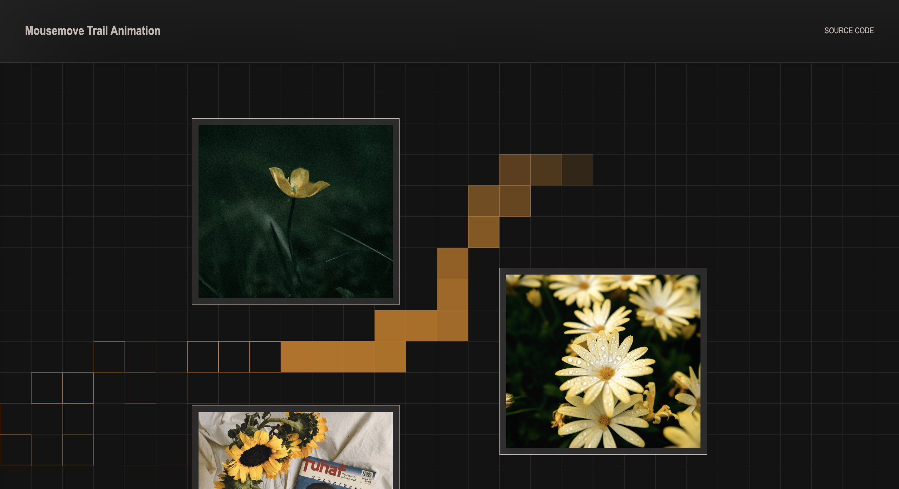

# Mousemove Trail Animation

 

The Mousemove Trail Animation project is a web-based visual effect that generates a series of div elements following the mouse cursor, creating a dynamic trail animation. This effect is achieved through HTML, CSS, and JavaScript, with divs being added and removed in response to mouse movements to simulate the trail.

## Getting Started

To use this project in your own work, follow these steps:

1. Clone the repository to your local machine.
2. Open `index.html` in your browser to view the project.
3. Customize the HTML, CSS, and JavaScript files as needed.

## Author

- [Farid Vatani - Software Engineer](https://github.com/faridvatani)

## Contributing

Contributions are welcome. Please feel free to fork this repository and open a pull request to add more features, fix bugs, improve documentation etc.

## Acknowledgements

This project was inspired by the "Awwwards Element" from [Neo Culture](https://www.neoculturalcouture.com/).

## License

This project is licensed under the MIT License - see the [LICENSE](LICENSE) file for details.